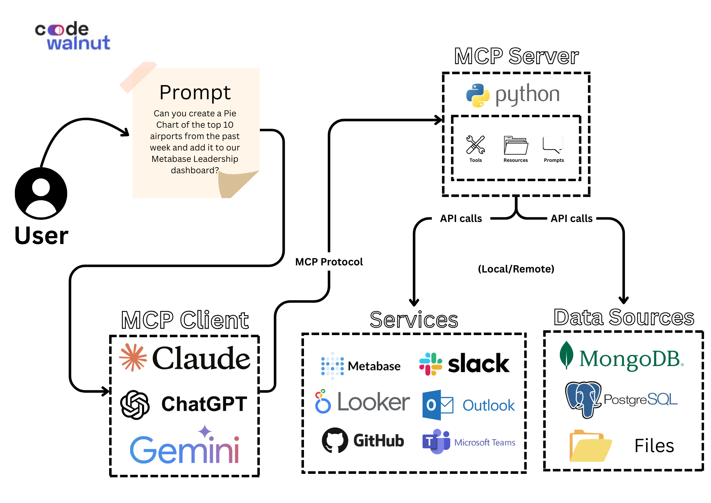

# 📊 Metabase MCP Server

## 📚 Table of Contents

1. [What is this tool about?](#-what-is-this-tool-about)
2. [Required Software](#-required-software)
3. [Architecture Diagram](#-architecture-diagram)
4. [Getting Started](#-getting-started)
   - [Set Up Metabase](#1-set-up-metabase-if-you-havent-already)
   - [Clone or Download the Repository](#2-clone-or-download-the-repository)
   - [Install uv Package Manager](#3-install-uv-package-manager)
   - [Create a Virtual Environment](#4-create-a-virtual-environment)
   - [Install Requirements](#5-install-requirements)
   - [Configure Your .env](#6-configure-your-env)
   - [Connect to Your AI Client](#7-connect-to-your-ai-client)
5. [Available Tools](#-available-tools)
6. [Example Prompts to Try](#-example-prompts-to-try)
7. [License](#-license)

---

## 😊 What is this tool about?

**Metabase MCP Server** is a backend integration layer that connects your **Metabase** instance with **AI assistants** using the **Model Context Protocol (MCP)**. This allows business leaders, product managers and analysts to interact with business intelligence assets like dashboards and charts using **natural language**—through any MCP-compatible AI client (e.g., Claude Desktop).

Instead of navigating through menus or constructing SQL queries manually, you can:

- You can ask a question and get an instant insight.
- Generate dashboards and charts by describing what you want.
- Manage user access and database connections through simple instructions.

This project makes Metabase not just a dashboarding tool—but a conversational, intelligent business assistant.

---

## 🧰 Required Software

Make sure the following software is installed and available in your system path:

-   **Python 3.11+** – Required to run the MCP server backend. [Download Python](https://www.python.org/downloads/)
    
-   **Node.js** – Required for running auxiliary MCP components or inspectors. [Download Node.js](https://nodejs.org/)
        
-   **Any MCP-compatible AI client** – Example: Claude Desktop. [Download Claude Desktop](https://claude.ai/download)

---

## 📐 Architecture Diagram



---

## 🚀 Getting Started

### 1. Set Up Metabase (If you haven't already)

Follow the official Metabase installation guide: [Metabase Docs](https://www.metabase.com/docs/latest/installation-and-operation/installing-metabase)

---

### 2. Clone or Download the Repository

You need to get this tool onto your computer. You can either download it manually or use Git.
Open your computer's Terminal (Mac) or Command Prompt (Windows).
Navigate to the folder where you unzipped the files or want to clone the project:

```bash
# Example (replace with your actual path):
cd ~/Downloads/metabase-mcp-server-dev
```

**Option 1: Download ZIP**

1.  Go to the [GitHub repository](https://github.com/codewalnut/metabase-mcp-server)
    
2.  Click the green **"Code"** button
    
3.  Select **"Download ZIP"**
    
4.  Unzip the downloaded file to a location like your **Documents** folder
    

**Option 2: Use Git** If you're familiar with Git, run this in your terminal:

```bash
git clone https://github.com/codewalnut/metabase-mcp-server.git
cd metabase-mcp-server

```

---

### 3. Install uv Package Manager

Install `uv` using:

```bash
pip install uv
```

---

### 4. Create a Virtual Environment

```bash
uv venv .venv

# Windows
.venv\Scripts\activate

# macOS/Linux
source .venv/bin/activate
```

---

### 5. Install Requirements

```bash
uv pip install -r requirements.txt
```

---

### 6. Configure Your `.env`

Create a `.env` file and add:

```env
METABASE_URL=http://127.0.0.1:3000
METABASE_API_KEY=mb_xxx_your_api_key
```
---

### 7. Connect to Your AI Client

If you are using **Claude Desktop**, you need to modify your `claude_desktop_config.json` file.

##### Windows Path:
```plaintext
C:\Users\<YOUR_USERNAME>\AppData\Roaming\Claude\claude_desktop_config.json
```

##### macOS Path:
```plaintext
~/Library/Application Support/Claude/claude_desktop_config.json
```

Inside the config file, add:

```json
{
  "mcpServers": {
    "metabase": {
      "command": "FULL_PATH\\metabase-mcp-server\\.venv\\Scripts\\python.exe",
      "args": ["FULL_PATH\\metabase-mcp-server\\src\\metabase_mcp_server.py"]
    }
  }
}
```


#### Important Notes

- Replace `FULL_PATH` with the actual location of your project directory.
- After saving the changes, **restart Claude Desktop** to apply the new configuration.

 - The `command` and `args` paths depend on your operating system.

**Windows Example:**
```json
"command": "FULL_PATH\\metabase-mcp-server\\.venv\\Scripts\\python.exe",
"args": ["FULL_PATH\\metabase-mcp-server\\src\\metabase_mcp_server.py"]
```

**macOS/Linux Example:**
```json
"command": "FULL_PATH/metabase-mcp-server/.venv/bin/python",
"args": ["FULL_PATH/metabase-mcp-server/src/metabase_mcp_server.py"]
```

**Key Differences:**
- Windows uses **backslashes** `\\` and `.exe` files.
- macOS/Linux uses **forward slashes** `/` and no `.exe`.

Make sure to match the correct format based on your OS to avoid errors.

> **Note:**  
> For other AI clients, configure them similarly by setting the correct `command` to your Python executable and `args` to your MCP Server script path, based on your operating system.

---

## 🔧 Available Tools

| Function                         | Description                                     |
|----------------------------------|-------------------------------------------------|
| **Collection Operations** ||
| `get_metabase_collection`     | Get a collection by ID                          |
| `create_metabase_collection`  | Create a new collection                         |
| `update_metabase_collection`  | Update collection metadata                      |
| `delete_metabase_collection`  | Delete a collection                             |
| **Chart (Card) Operations** ||
| `get_metabase_cards`          | List all charts                                 |
| `get_card_query_results`      | Get results from a chart query                  |
| `create_metabase_card`        | Create a new chart                              |
| `create_simple_visualization` | Create a simple visualization                  |
| `update_metabase_card`        | Update an existing chart                        |
| `delete_metabase_card`        | Delete a chart                                  |
| **Dashboard Operations** ||
| `get_metabase_dashboards`     | List all dashboards                             |
| `get_dashboard_by_id`         | Get a dashboard by ID                           |
| `get_dashboard_cards`         | Get cards in a dashboard                        |
| `get_dashboard_items`         | Get all dashboard items                         |
| `create_metabase_dashboard`   | Create a dashboard                              |
| `update_metabase_dashboard`   | Update a dashboard                              |
| `delete_metabase_dashboard`   | Delete a dashboard                              |
| `copy_metabase_dashboard`     | Create a copy of an existing dashboard          |
| **Database Operations** ||
| `get_metabase_databases`      | List databases                                  |
| `create_metabase_database`    | Create a new database connection                |
| `update_metabase_database`    | Update a database connection                    |
| `delete_metabase_database`    | Delete a database connection                    |
| **User Operations** ||
| `get_metabase_users`          | List all users                                  |
| `get_metabase_current_user`   | Get current user details                        |
| `create_metabase_user`        | Create a new user                               |
| `update_metabase_user`        | Update user info                                |
| `delete_metabase_user`        | Delete a user                                   |
| **Group Operations** ||
| `get_metabase_groups`         | List user groups                                |
| `create_metabase_group`       | Create a user group                             |
| `delete_metabase_group`       | Delete a user group                             |
| **SQL Operations** ||
| `execute_sql_query`           | Execute a native SQL query                      |

---

## 🧪 Example Prompts to Try

- Create a dashboard called 'Flight Overview' with a bar chart showing flights by destination city.
- Run SQL: `SELECT origin, destination, COUNT(*) FROM flights GROUP BY origin, destination LIMIT 10`.
- Create a card displaying total bookings last month grouped by region.
- Delete the chart named 'Abandoned Queries'.
- Update the dashboard 'Sales KPIs' to include a new revenue card.
- Show all users in the 'Admin' group.
- Create a new group called 'Finance Analysts'.
- Connect to a Supabase database and list all tables.

---

## 📜 License

This project is licensed under the [Apache License 2.0](https://www.apache.org/licenses/LICENSE-2.0).

You can find the full license text in the [`LICENSE`](./LICENSE) file.

---
